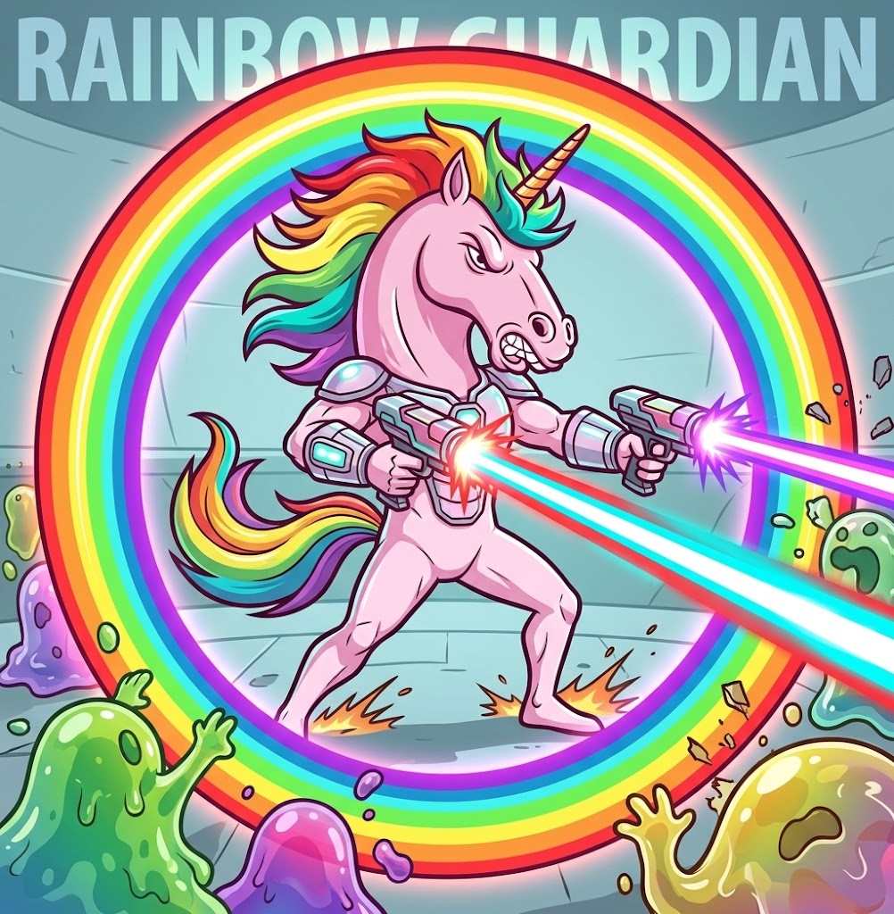
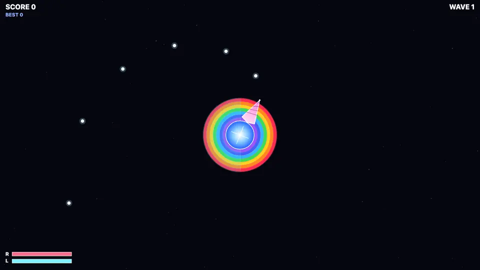

[](https://js13kgames.com/)
[](https://github.com/features/copilot)


Created for [js13kGames](https://js13kgames.com/) competition.
**Theme:** Rainbows and Unicorns. **Constraint:** web only, <= 13KB.

# Rainbow Guardian

<p align="center">
  
</p>

<p align="center">
  <a href="https://htmlpreview.github.io/?https://github.com/leereilly/release-cycle/blob/HEAD/index.html">
    
  </a>
</p>

GitHub is under attack from waves of incming slop. You, an angry unicorn, must keep the reactor core alive. Maintain the double-rainbow shields and take out slop with your slop cannon.

## Play

Serve the repository and open <http://localhost:8002>:

```sh
npm install
npm start
```

## Controls

- **SPACE / click / tap**: start the game, and during play, **reverse the horn's orbit** to swing
  its guard toward whichever half is under threat.
- **Firing is automatic**: the horn locks onto the nearest blob inside its wide facing arc.
- **M**: mute / unmute (persists between sessions).
- **P** or **ESC**: pause / resume. The game also auto-pauses when the tab is hidden.
- **Upgrades**: **LEFT / RIGHT** move the selection and **SPACE** confirms, or **tap a card**
  directly. A brief input lock after each screen change prevents accidental picks and reversals.

## The rainbow

Two independent halves (right and left) each start at **100 HP**. A blob that reaches a living
half peels its outer colour bands and pops. When a half is depleted, blobs pour through the gap;
if one reaches the core, the run ends. Threatened halves are outlined in **amber** (incoming) or
**red** (a slinger mid-dash) so you always know where to swing.

## Blobs

Four gelatinous families ooze in, each drawn as a translucent wobbling silhouette with a glassy
shine, googly eyes that track the core, velocity stretch, hit-squash, and a splat of goo on death:

- **GOO**: the basic green drifter.
- **SPLITTER**: a purple blob that bursts into two smaller goos when destroyed.
- **SLINGER**: a pink blob that winds up (dashed outline + telegraph ring), then dashes at the
  rainbow.
- **TANK**: a big, slow, tough blue blob that hits hard and splatters big.

Even waves arrive as mirrored pairs from opposite bearings; odd waves roll straight into the next.
Tougher families unlock as the waves climb.

## Scoring and chains

Every kill without taking rainbow damage extends your **chain**. Each 5 unbroken kills adds
**+0.5** to the score multiplier, up to **x5**. Damage to either half resets the chain, so a clean
defence is worth far more than trading hits for kills. Clearing a wave without a scratch pays a
bonus.

## Upgrades

After every second wave, choose one of three cards. Picks stack:

- **RAPID HORN**: fire faster
- **SHARP TIP**: +1 bullet damage
- **TWIN SHOT**: fire an extra bullet
- **SWIFT ORBIT**: orbit faster
- **RAINBOW ARMOR**: raise max HP and mend both halves
- **PLASMA ROUNDS**: bigger, stronger, faster shots
- **PIERCE BEAM**: shots punch through blobs

## Power-ups

Slain blobs sometimes drop a floating power-up; grab it with the horn or shoot it:

- **SPREAD**: faster three-way fire
- **TWIN HORN**: a mirrored second horn on the opposite side of the core
- **SLOW-MO**: every blob crawls for a few seconds
- **RAINBOW MEND**: instantly mends both halves
- **NOVA**: an instant shockwave that clears blobs near the core

## Build

The shipped game must fit in **13,000 bytes zipped**. The pipeline concatenates the sources,
compiles with Closure (ADVANCED), minifies with UglifyJS, compresses with Roadroller, inlines
everything into one HTML file, and zips it with ect:

```sh
npm run build
```

This writes `dist/index.html` and `rainbow-guardian.zip`, printing the exact size and failing if
the ZIP exceeds **13,000 bytes**. The current build is well under budget (about **6.8 KB**).
